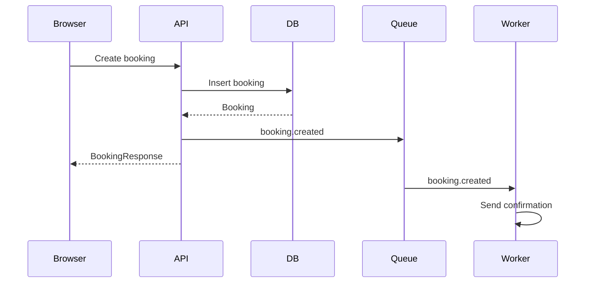

# Notation

Use the smallest notation set that answers the design question precisely. Do not express the same information in multiple notations unless each view adds information required for implementation.

## Contract

### TypeScript contracts

**Answers**: what shapes and signatures exist.

**Use for**: types, interfaces, ports, DTOs, function signatures, and public APIs.

Write signatures without bodies.

```typescript
type ServiceId = string & { readonly __brand: unique symbol }

interface CreateBookingInput {
   serviceId: ServiceId
   startsAt: Date
   customerName: string
}

function createBooking(input: CreateBookingInput, deps: CreateBookingDependencies): Promise<Booking>
```

### Type chain

**Answers**: How does one value change representation?

**Use for**: parsing, validation, mapping, serialization, and transformations between transport, application, domain, and presentation types.

```text
HTTP body: unknown
   -> requestSchema.parse
   -> CreateBookingRequest
   -> toCreateBookingInput
   -> CreateBookingInput
   -> createBooking
   -> Booking | CreateBookingError
   -> toBookingResponse
   -> BookingResponse
```

## Behavior

### Pseudocode

**Answers**: what rules or algorithms govern behavior.

**Use for**: business rules, conditions, branching, and and behavior where concrete implementation syntax would add noise.

```text
on(createBooking)
   if service does not exist
      return service-not-found

   if slot is unavailable
      return slot-unavailable

   create booking
   return booking
```

### State machine

**Answers**: What states exist and which transitions are valid?

**Use for**: behavior governed by discrete states and allowed transitions.

```text
draft
   --submit--> pending

pending
   --approve--> confirmed
   --reject--> rejected

confirmed
   --cancel--> cancelled
```

Use Mermaid diagrams only when the transition graph becomes difficult to read as text.

### Event flow

**Answers**: What behavior follows from an event?

**Use for**: UI events, domain events, asynchronous events, and event-driven side effects.

```text
click Save
   -> validate form
   -> save mutation
   -> mutation succeeds
   -> invalidate session query
   -> show success state
```

Or asynchronous:

```text
booking.created
   -> sendConfirmation
   -> updateCalendar
   -> emitAnalyticsEvent
```

Start from the event. Use a call stack instead when the important question is the exact function execution path.

## Execution

### Call stack

**Answers**: what exact execution path occurs for a concrete operation.

**Use for**: a concrete end-to-end ordered execution through functions and boundaries.

```
POST /bookings
   -> parseCreateBookingRequest
   -> createBooking
      -> ensureSlotAvailable
      -> bookingRepository.insert
         -> db.insert(bookings)
   -> toBookingResponse
   -> jsonResponse
```

### Call tree

**Answers**: What operations can this operation delegate to?

**Use for**: responsibility decomposition and branching subordinate operations.

```text
createBooking
├── loadService
│   └── serviceRepository.findById
├── ensureSlotAvailable
│   └── bookingRepository.findConflicts
├── persistBooking
│   └── bookingRepository.insert
└── publishBookingCreated
   └── eventPublisher.publish
```

### Data flow

**Answers**: Where does data originate, move, and get consumed?

**Use for**: tracing data across layers, processes, caches, persistence, or UI boundaries.

```text
Form state
   -> submit event
   -> request DTO
   -> API boundary
   -> application input
   -> domain result
   -> response DTO
   -> query cache
   -> rendered UI
```

## Sequence diagram

**Answers**: How do multiple runtime participants interact over time?

**Use for**: cross-process or cross-system flows where participants and temporal ordering matter, especially async work, queues, webhooks, retries, browser/server hops, or external services.



Use a call stack for a single execution path inside one runtime.

## UI

### UI Component tree

**Answers**: What UI structure exists and who owns it?

**Use for**: component hierarchy, hooks, state ownership, and module boundaries.

```typescript
<BookingPage> // features/booking/page.tsx
   useBookingForm()

   <BookingHeader />

   <BookingForm>
      <ServiceSelector />
      <DatePicker />
      <TimeSlotPicker />
      <SubmitButton />
   </BookingForm>

   <BookingSummary />
</BookingPage>
```

Annotate files or packages only when ownership matters.

### UI state model

**Answers**: What renderable states can a component or screen have?

**Use for**: mutually exclusive UI states and the data available in each state.

```typescript
type BookingPageState =
   | { type: 'loading' }
   | { type: 'ready'; services: Service[] }
   | { type: 'submitting'; services: Service[] }
   | { type: 'success'; booking: Booking }
   | { type: 'error'; error: BookingError }
```

When the rendered result is not obvious, add the mapping in the same block:

```text
BookingPage
   loading
      -> <BookingSkeleton />

   ready
      -> <BookingForm />

   submitting
      -> <BookingForm disabled />
      -> <SubmitButton loading />

   success
      -> <BookingConfirmation />

   error
      -> <BookingForm />
      -> <ErrorMessage />
```

### Interaction rules

**Answers**: How does the UI respond to user actions?

**Use for**: local interaction behavior, dependent state changes, and immediate user-facing effects.

```text
on(service change)
   clear selected time slot
   load availability for selected service

on(time slot click)
   select slot
   enable Continue

on(submit)
   disable Submit
   show pending indicator
```

### Visual states

**Answers**: How does a component present each interaction or runtime state?

**Use for**: default, hover, focus, disabled, loading, selected, error, and similar presentation states.

```text
Button
├── default
│   └── cursor: pointer
├── hover
│   └── emphasize background
├── focus-visible
│   └── show focus ring
├── disabled
│   ├── non-interactive
│   └── reduced emphasis
└── loading
   ├── preserve width
   ├── show spinner
   └── reject repeated activation
```

### Accessibility rules

**Answers**: What semantic, keyboard, focus, and announcement behavior is required?

**Use for**: concrete accessibility behavior that implementation must preserve.

```text
Dialog
   role="dialog"
   aria-modal="true"

on(open)
  move focus to first interactive control

on(Tab)
  keep focus inside dialog

on(Escape)
  close dialog

on(close)
  restore focus to trigger
```

Avoid generic requirements such as must be accessible. State observable behavior.

## Structure

### File tree

**Answers**: Where does code belong and which area owns each responsibility?

**Use for**: repository structure, module placement, and ownership boundaries.

```text
booking/
├── application/                 # owns use cases and ports
│   └── create-booking.ts
├── domain/                      # owns booking rules and types
│   └── booking.ts
├── data/                        # implements persistence ports
│   └── booking-repository.ts
└── presentation/                # owns transport boundary
  ├── booking-route.ts
  └── booking-presenter.ts
```

Use # comments only when the path alone does not make ownership clear.

## Modifier

### Diff

**Answers**: What changes from the known current design?

**Use for**: modifications where showing only the delta is clearer than restating the complete structure.

Prefix removed lines with `-` and added lines with `+`. Apply the diff to the appropriate notation.

```diff
 createBooking
   -> ensureSlotAvailable
+  -> calculatePrice
   -> bookingRepository.insert
-  -> sendConfirmation
+  -> eventPublisher.publish(booking.created)
```

A diff is a modifier of another notation, not a separate architectural view. Use it only when the current design is already known.
